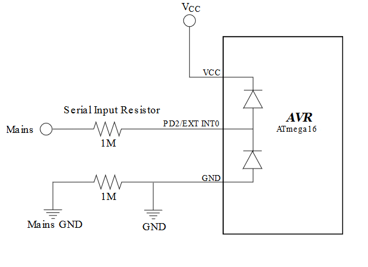

# ATMEGA16 Zero Cross Detector

One of the many issues with developing modern applications is to keep the spikes and EMI at a minimum, especially when switching AC mains in and out. Most of today’s new applications are controlled by one or more microcontrollers and this gives the possibility to prevent this noise in a simple and cost efficient way.

Noise produced during switching is dependent on the amplitude of the AC sinus at the actual switching point. To get this noise as low as possible the ideal switching would be when the amplitude is 0 volt. The amplitude is crossing 0 volt at the sinus “zero crossing”. Switching mains in and out at the zero crossing requires a way of detecting when the next crossing will be and launching a switching action at the crossing. This raises the need for a cost efficient way to detect the zero crossing. This application note explains how to do that.

Zero cross detection can also be used for other purposes, such as frequency calculation and relative phase measuring.

An example of how to make a zero cross detector with a ATmega16 is given here which is based on the appnote [AN_2508](https://www.microchip.com/wwwAppNotes/AppNotes.aspx?appnote=en591171).

## Related Documentation

- [AN_2508 - Zero Cross Detector](https://www.microchip.com/wwwAppNotes/AppNotes.aspx?appnote=en591171)
- [ATmega16 Product Page](https://www.microchip.com/wwwproducts/en/ATmega16)

## Software Used

- [Atmel Studio 7.0.2397 or later](https://www.microchip.com/mplab/avr-support/atmel-studio-7)
- ATmega_DFP 1.4.351 or later
- AVR/GNU C Compiler 5.4.0 (built into studio)

## Hardware Used

-  [ATmega16 TQFN](https://www.microchip.com/wwwproducts/en/ATmega16)
-  [STK600](https://www.microchip.com/developmenttools/ProductDetails/ATSTK600)
-  [STK600 Routing card](https://www.microchip.com/DevelopmentTools/ProductDetails/PartNO/ATSTK600-RC31)
-  [STK600 TQFP44](https://www.microchip.com/developmenttools/ProductDetails/ATSTK600-SC06)
- Logic analyser & wave generator to simulate mains and verify signal
## Setup

1. Connect the wavesource/wave generator to `PD2`.
2. Connect the logic analyser/output to `PB0`.

## Operation

1. Clone or download this repo.
2. Open `atmega16-zero-cross-detector-studio.atsln` in Atmel Studio.
3. Connect the ATmega16 with your programmer of choice, we used a STK600.
4. In your menu bar in Atmel Studio go to `Debug->Start Without Debugging` or press `CTRL + ALT + F5`.
5. Generate a sinus waveform with **max** `VCC+0.5V` on `PD2` with a frequency of for example 50 Hz.
6. The logic analyser will then show a pulse train equivalent to that frequency on `PB0`.

## Conclusion

We have shown how you can make a simple zero cross detector with a ATmega16. For more detailed workings about this example please refer to the appnote [AN_2508](https://www.microchip.com/wwwAppNotes/AppNotes.aspx?appnote=en591171).